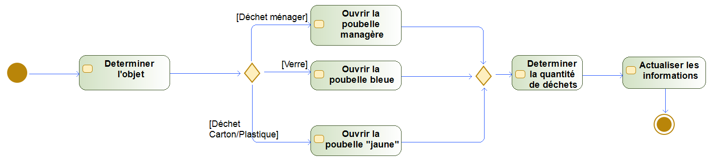
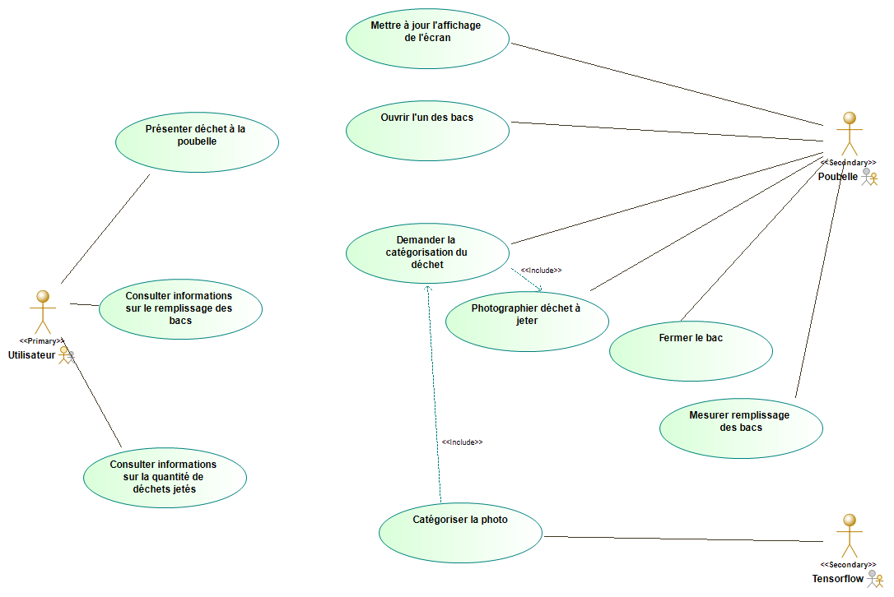
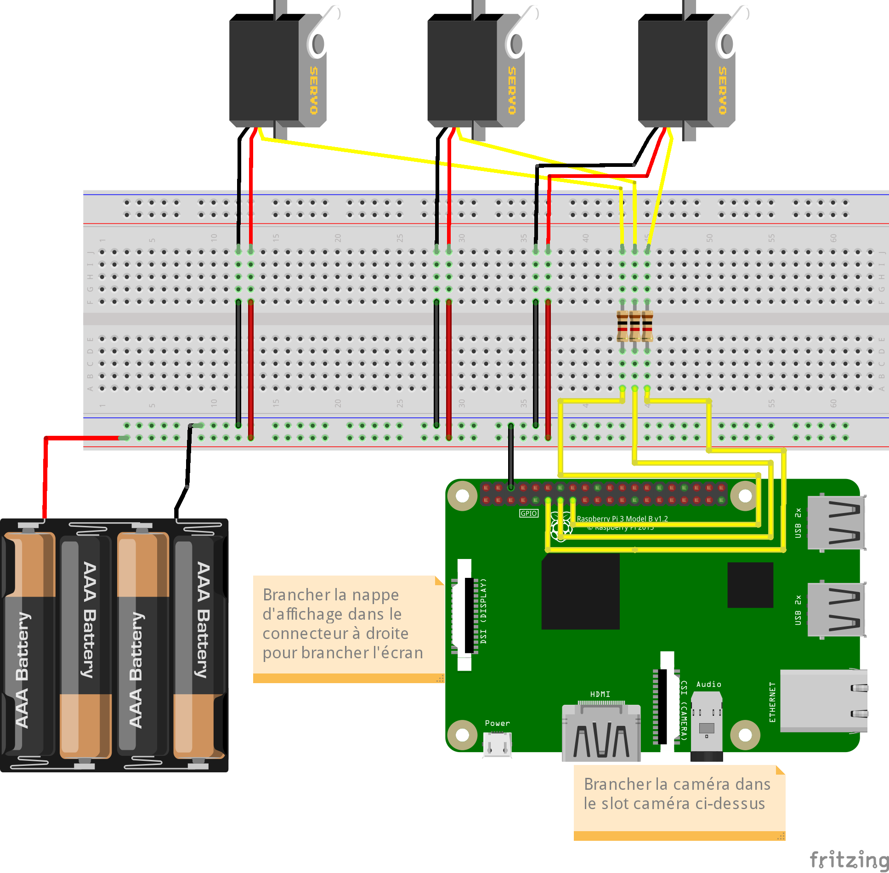
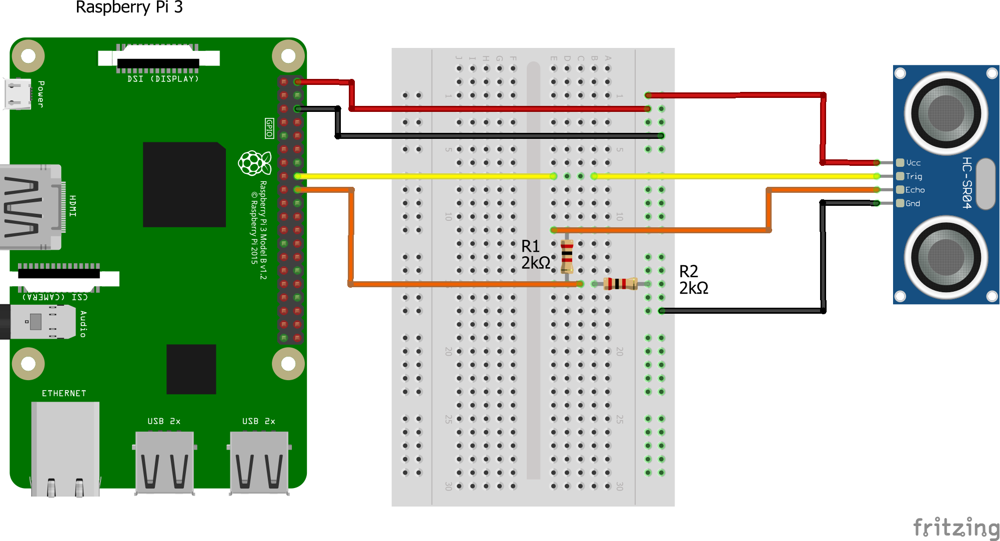

# La poubelle connectée Eco3, par Karadik
L'équipe Karadik est fière de vous présenter son projet de poubelle connectée. Grâce à elle, fini les prises de tête lorsque vous devez jeter un déchet à la poubelle.

## Description
L'écologie est une thématique importante en ce début de 21ème siècle : pendant trop longtemps l'Homme a pollué la planète sans trop se soucier des conséquences. Cependant, depuis quelques années, on en constate de plus en plus les effets : disparition prématurée d'espèces animales, fontes des glaces, augmentation du niveau des eaux, catastrophes naturelles de plus en plus fréquentes, et réchauffement climatique, pour en citer quelques-uns.

On constate ainsi une prise de conscience générale des Hommes quant à cette problématique (malheureusement assez tardive), et nous sommes de plus en plus sensibilisé à l'écologie, et notamment au recyclage.

C'est dans ce domaine que Karadik souhaite apporter sa pierre à l'édifice en présentant Eco3, sa poubelle connectée. Le principe de base est simple : une intelligence artificielle se chargera de reconnaître les déchets que vous jetez, et de vous ouvrir le bon bac de recyclage afin qu'ils puissent correctement être recyclés. 

De plus, par l'intermédiaire d'un écran placé sur la poubelle, vous pourrez non seulement savoir à quel moment les bacs sont à vider, mais également connaître la quantité de déchets que vous aurez jetés dans chacun d'entre eux. 

En plus d'être simple d'utilisation, cela permet aussi d'apprendre aux enfants à recycler dès leur plus jeune âge, et de leur inculquer de bonnes habitudes.

### Détails supplémentaires techniques
Pour la reconnaissance d'images, une caméra est placée sur le couvercle de la poubelle, et celle-ci prend une photo du déchet que l'utilisateur lui aura présenté. 

En utilisant l'outil Tensorflow, on comparera la photo prise avec une bibliothèque d'images de déchets regroupés en plusieurs catégories (i.e. papier, plastique, carton, verre, déchets alimentaires, ...).

Une fois la photo catégorisé, on actionnera le moteur permettant d'ouvrir le bon bac afin que l'utilisateur puisse jeter son déchet.

On reprendra une mesure avec le SONAR placé dans le bac sus-mentionné afin de recalculer le taux de remplissage de la poubelle, et on mettra à jour l'affichage de l'écran.

## État de l'art

### Bin.E - [Site officiel](http://www.bine.world/)

*(Crédits photo - [Bin-E](https://twitter.com/bineworld))*

Conçue par la start-up polonaise Bin.E, cette poubelle reconnaît, comprime et trie différents types de déchets (verre, plastique, papier, et métal) grâce à un système placé à l'intérieur de la poubelle qui utilise des capteurs, la reconnaissance d'images et une intelligence artificielle. Un écran tactile, placé sur la poubelle, permet d'informer l'utilisateur de la quantité de déchets présents dans chaque bac.

Sortie en 2018, elle est surtout destinée aux professionnels : elle est vendue autour de 500 euros, et une application d'accompagnement pour smartphone, qui les met en relation avec des services de collecte, est facturée sous forme d'abonnement mensuel à un prix de 120 euros.

### Le boîtier Eugène - [Site officiel](https://www.uzer.eu/)

*(Crédits photo - [Site officiel de Uzer](https://www.uzer.eu/))*

Conçue par la start-up française française Uzer, Eugène est un boîtier à fixer à proximité d'une poubelle afin de pouvoir scanner les code-barres des produits avant de les jeter, dans le but d'afficher leurs consignes de tri. Ce boîtier ne propose pas d'intelligence artificielle.

Commercialisé en 2017 à destination du grand public, Eugène est vendu à 79€ et une application gratuite est également disponible sur Android et iOS. Depuis cette dernière, il est possible de scanner ses produits directement depuis son téléphone afin de connaître les consignes de tri des déchets scannés. 

### R3D3 - [Site officiel](https://www.green-creative.com/r3d3/collecte-recyclage)

*(Crédits photo - [La Tribune](https://www.latribune.fr/regions/ile-de-france/green-creative-les-poubelles-connectees-qui-simplifient-le-recyclage-762550.html))*

Conçue en 2018 par l'entreprise française *Green Creative*, la poubelle R3D3 reconnaît, trie et compacte automatiquement les canettes, les gobelets et les bouteilles en plastique. Elle favorise ainsi le recyclage du plastique et de l'aluminium. Les gobelets de café, les bouteilles et canettes sont séparées, compactées et rangées dans des box distincts. Cela permet de faciliter la collecte et surtout le tri.

> R3D3 peut ainsi engloutir « _l'équivalent de 100 bouteilles, 300 canettes et 400 gobelets_ »

Grâce à la compression, elle permet aussi d’organiser moins de collectes, et donc de limiter des émissions de CO2. Par ailleurs, R3D3 avertit elle-même les responsables de l’entretien lorsqu’il y a besoin de la vider. Via une interface web dédiée, les entreprises peuvent ensuite suivre des indicateurs concernant leurs déchets.

En raison de ses dimensions et de son poids important (environ 60 kilos), ainsi que de son coût, la poubelle R3D3 est plus orientée pour les entreprises.

## Composants nécessaires
- Une poubelle à 3 bacs
- Raspberry Pi 3 Modèle B+ 1 GB (avec alimentation, ventilateur, et carte microSD)
- 1x module caméra 5 MP
- 1x écran
- 3x servomoteurs
- 3x télémètres à ultrasons (SONAR)
- 3x capteurs de poids ? 
- Des résistances et des câbles

## Étude fonctionnelle

### Diagrammes UML
Dans cette partie nous allons spécifier le système qui sera mis en place dans notre projet. Pour cela nous avons commencé par développer des diagrammes UML.

Diagramme d'activité : 

Diagramme de cas d'utilisation : 

### Exemples de branchements sur Fritzing
Ce premier schéma montre comment on devrait procéder pour brancher les servomoteurs, la caméra et l'écran au Raspberry Pi.

Ce second schéma montre comment on devrait procéder pour brancher l'un des télémètres à ultrasons au Raspberry Pi. Comme dans l'exemple précédent, on pourrait aussi utiliser une alimentation externe.

## Membres de l'équipe participant au projet
 - Nady SADDIK
 - Alexandre KARAKAS