# Exercice 1

Dans cet exercice on cherche à contrôler la luminosité d'une LED par l'intermédiaire d'une résistance variable (avec un Arduino UNO). On va donc tester 2 méthodes :

 - Sans microcontrôleur
 - Avec un microcontrôleur

## Sans microcontrôleur

Les branchements sont assez simples, on a eu besoin de quelques câbles, d'une résistance, d'un potentiomètre et d'une LED.

    int LED = 13;
    
    void setup()
    {
      pinMode(LED, OUTPUT);
    }
    
    void loop()
    {
      int reading = analogRead(A0);
      reading = map(reading, 0, 1023, 0, 255); // Mapping reading to get values between 0 and 255
      analogWrite(LED, reading);
    }
Le code est également assez sommaire, on déclare une variable LED initialisée à 13 (car c'est sur le port 13 de la carte Arduino qu'elle est branchée). La fonction pinMode va assigner le port de la LED en sortie.
On utilise analogRead(A0) pour lire la valeur du potentiomètre *(branché au port A0)*, afin de l'assigner à la LED.

Cela nous donne les résultats suivants : 

> Résistance élevée
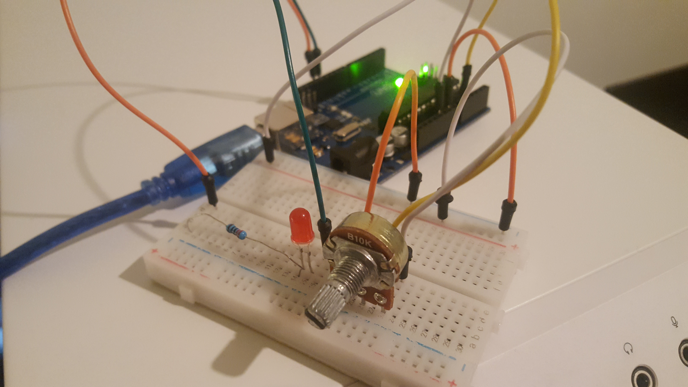

> Résistance moyenne
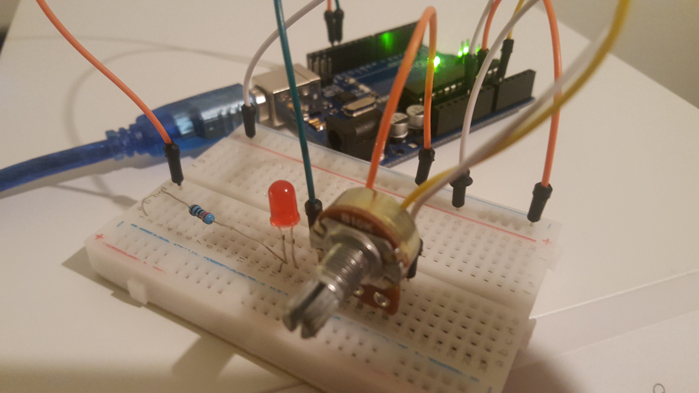

> Résistance faible
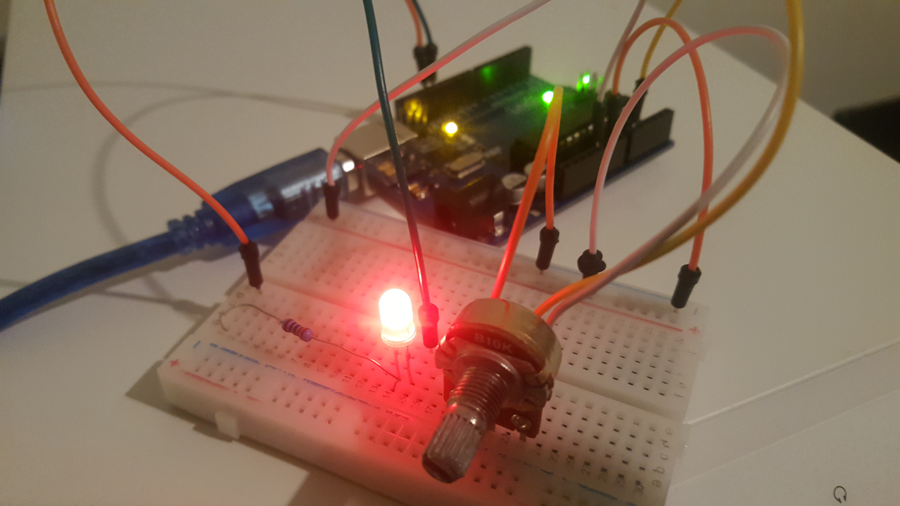

## Avec un microcontrôleur

Les branchements sont très similaires à la partie précédente.

    int LED = 3;
    
    void setup()
    {
      pinMode(LED, OUTPUT);
    }
    
    void loop()
    {
      int PWM = analogRead(A0);
      PWM = map(PWM, 0, 1023, 0, 255); // Mapping reading to get values between 0 and 255
      analogWrite(LED, PWM);
    }

La LED est cette fois-ci branchée au port 3 afin de récupérer un signal PWM en sortie. On récupère cette valeur avec la fonction analogRead, et on l'assigne à la LED.

Cela nous donne les résultats suivants : 
 
> Résistance élevée
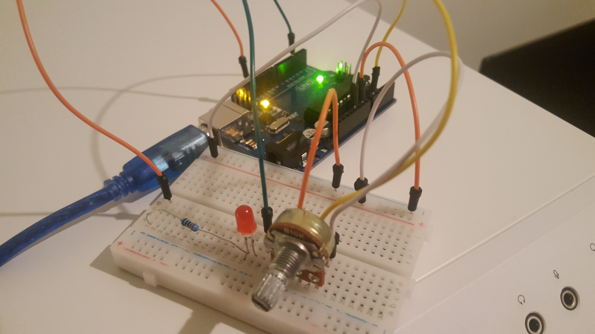

> Résistance moyenne
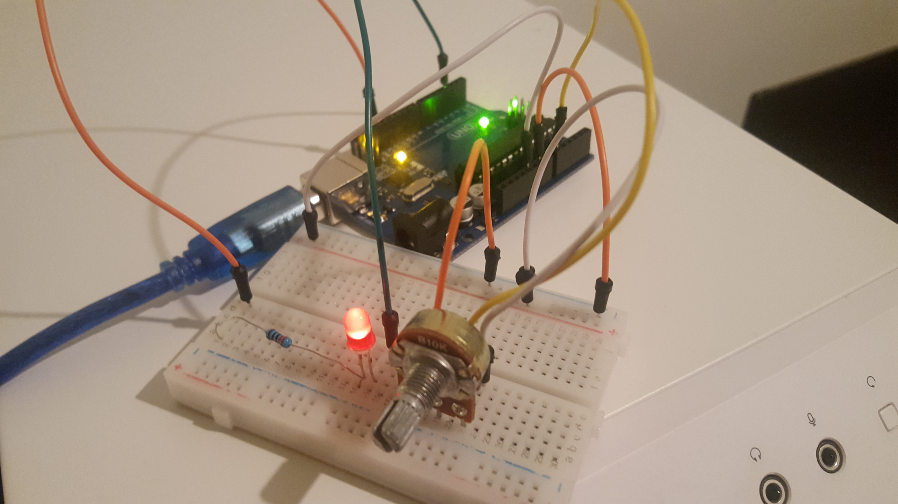

> Résistance faible
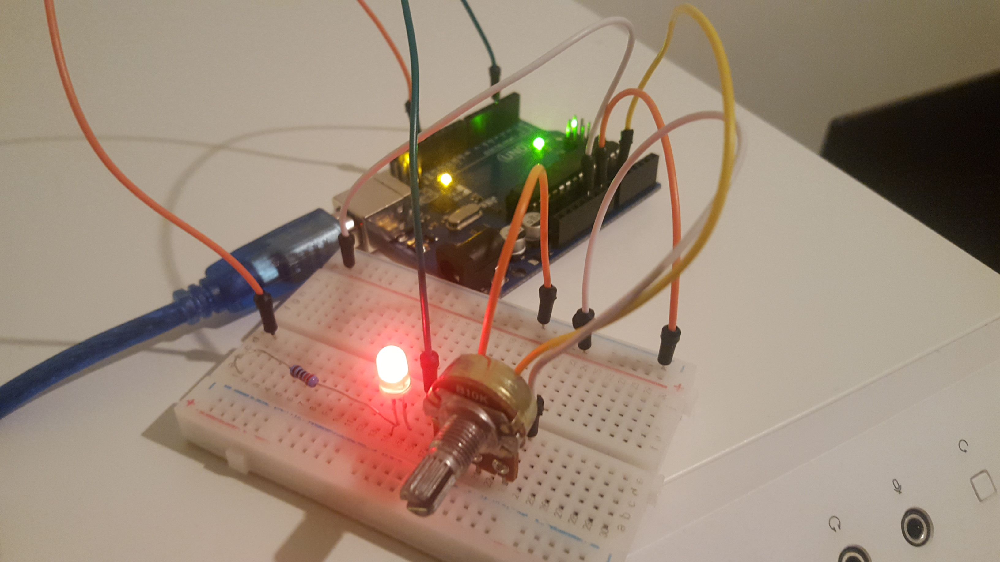

## Conclusion
On peut clairement remarquer que l'utilisation du microcontrôleur est bien plus efficace. En effet, sans ce dernier, on ne peut pas régler de manière précise la luminosité de la LED : elle est soit allumée à pleine puissance, soit éteinte. Avec le microcontrôleur, on a un contrôle bien plus précis sur son intensité lumineuse.

# Exercice 2
Dans cet exercice on cherche à contrôler un afficheur 4x7 segments, dans un premier temps sans utiliser un MAX7219, et dans un second temps avec.

## Sans MAX7219 (LESSON 15)
Les branchements sont un peu plus compliqués que dans l'exercice précédent, dans le sens où il y a beaucoup plus de branchements, et de résistances à inclure. De plus, il nous a fallu adapter le modèle présenté dans le tutoriel, car notre afficheur 4x7 segments comporte 12 pins, et non 16.

    #include <time.h>
    
    // Different segments
    const unsigned int A = 9; 
    const unsigned int B = 13;
    const unsigned int C = 4; 
    const unsigned int D = 6; 
    const unsigned int E = 7; 
    const unsigned int F = 10; 
    const unsigned int G = 3; 
    const unsigned int DP = 5; 
     
    const unsigned int Anode1 = 8;
    const unsigned int Anode2 = 11;
    const unsigned int Anode3 = 12;
    const unsigned int Anode4 = 2;
     
    // digit is the digit to display. Note that 4 is the furthest right and 1 is the furthest left
    unsigned int digit = 1;
    // incoming byte value
    char buffer[4];
    String value = "0";
    char a;
    unsigned int decimal = 0;
    unsigned int length = 1;
    
    void setup() {
      
      Serial.begin(9600);
      Serial.print(value);
      
    // Pin Setup
      pinMode(Anode1, OUTPUT);
      pinMode(Anode2, OUTPUT);
      pinMode(Anode3, OUTPUT);
      pinMode(Anode4, OUTPUT);
      
      
      pinMode(A,OUTPUT);
      pinMode(B,OUTPUT);
      pinMode(C,OUTPUT);
      pinMode(D,OUTPUT);
      pinMode(E,OUTPUT);
      pinMode(F,OUTPUT);
      pinMode(G,OUTPUT);
      pinMode(DP,OUTPUT);
      
      
    }
    
    void decodeAndWrite(unsigned int value){
     // Write values all high to turn off the previous number
       
      digitalWrite(A,HIGH);
      digitalWrite(B,HIGH);
      digitalWrite(C,HIGH);
      digitalWrite(D,HIGH);
      digitalWrite(E,HIGH);
      digitalWrite(F,HIGH);
      digitalWrite(G,HIGH);
      digitalWrite(DP,HIGH);
      
      switch(value){
        //  cases for each digit
         
        case 0:
         
        digitalWrite(A,LOW);
        digitalWrite(F,LOW);
        digitalWrite(E,LOW);
        digitalWrite(D,LOW);
        digitalWrite(C,LOW);
        digitalWrite(B,LOW);  
        break;
         
        case 1:
        
        digitalWrite(C,LOW);
        digitalWrite(B,LOW);
        break;
         
        case 2:
         
        digitalWrite(A,LOW);
        digitalWrite(G,LOW);
        digitalWrite(E,LOW);
        digitalWrite(D,LOW);
        digitalWrite(B,LOW);
        break;
         
        case 3:
         
        digitalWrite(C,LOW);
        digitalWrite(B,LOW);
        digitalWrite(A,LOW);
        digitalWrite(G,LOW);
        digitalWrite(D,LOW);
        break;
         
        case 4:
         
        digitalWrite(F,LOW);
        digitalWrite(B,LOW);
        digitalWrite(G,LOW);
        digitalWrite(C,LOW);
        break;
         
        case 5:
         
        digitalWrite(A,LOW);
        digitalWrite(F,LOW);
        digitalWrite(G,LOW);
        digitalWrite(C,LOW);
        digitalWrite(D,LOW);
        break;
         
        case 6:
         
        digitalWrite(C,LOW);
        digitalWrite(G,LOW);
        digitalWrite(E,LOW);
        digitalWrite(D,LOW);
        digitalWrite(F,LOW);  
        break;
         
        case 7:
         
        digitalWrite(A,LOW);
        digitalWrite(B,LOW);
        digitalWrite(C,LOW);
        break;
         
        case 8:
         
        digitalWrite(A,LOW);
        digitalWrite(F,LOW);
        digitalWrite(B,LOW);
        digitalWrite(G,LOW);
        digitalWrite(C,LOW);
        digitalWrite(D,LOW);
        digitalWrite(E,LOW);  
        break;
         
        case 9:
         
        digitalWrite(A,LOW);
        digitalWrite(F,LOW);
        digitalWrite(B,LOW);
        digitalWrite(G,LOW);
        digitalWrite(C,LOW);
        break;
         
        default:
        // if unknown value, display nothing
        break;
         
      }
    }
    
    void loop() {
      time_t t = time(NULL);
      struct tm tm = *localtime(&t);
    
      sprintf(buffer, "%02d%02d", tm.tm_mday, tm.tm_mon + 1);
      for (int i=0; i<4; i++) {
        digit=4-i;
        switch(digit){
       
          case 1:
           
          digitalWrite(Anode1,HIGH);
          digitalWrite(Anode2,LOW);
          digitalWrite(Anode3,LOW);
          digitalWrite(Anode4,LOW);
          decodeAndWrite(buffer[0] - '0');
          break;
           
          case 2:
           
          digitalWrite(Anode1,LOW);
          digitalWrite(Anode2,HIGH);
          digitalWrite(Anode3,LOW);
          digitalWrite(Anode4,LOW);
          decodeAndWrite(buffer[1] - '0');
          break;
           
          case 3:
           
          digitalWrite(Anode1,LOW);
          digitalWrite(Anode2,LOW);
          digitalWrite(Anode3,HIGH);
          digitalWrite(Anode4,LOW);
          decodeAndWrite(buffer[2] - '0');
          break;
             
          case 4:
           
          digitalWrite(Anode1,LOW);
          digitalWrite(Anode2,LOW);
          digitalWrite(Anode3,LOW);
          digitalWrite(Anode4,HIGH);
          decodeAndWrite(buffer[3] - '0');
          break;
           
          default:
          //too many digits given!
          digitalWrite(Anode1,LOW);
          digitalWrite(Anode2,LOW);
          digitalWrite(Anode3,LOW);
          digitalWrite(Anode4,LOW);
          break;
           
           
          }
          delay(1);
      }
    }
Étant donné qu'on souhaite afficher la date (Jour.Mois), on a besoin d'un buffer à 4 charactères. Dans ce dernier, on va pouvoir stocker la date au format JJMM *(on utilise pour cela la bibliothèque time.h)*.

Dans la fonction setup, on assigne chaque PIN de notre afficheur à la sortie (on s'est servi du schéma présent dans le tutoriel).
La fonction decodeAndWrite permet d'afficher une valeur sur l'un des segments de l'afficheur numérique.
Dans la fonction loop, on récupère la date et on affiche chaque chiffre sur les différents panneaux.

Cela nous donne le résultat suivant : 

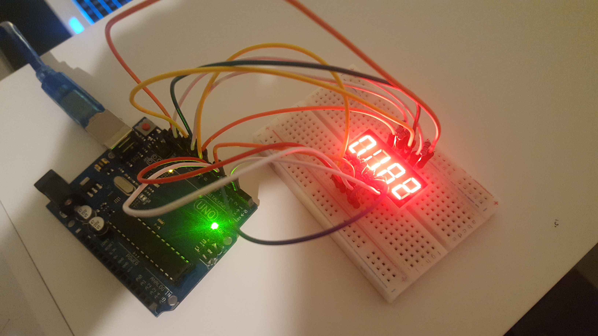
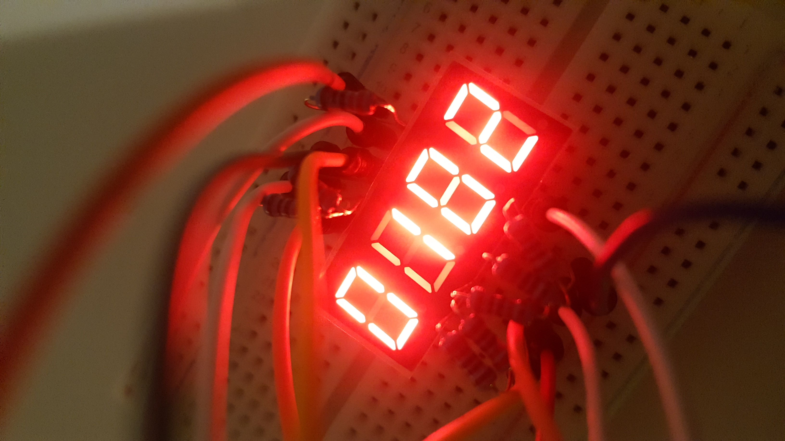

## Avec un MAX7219
Les branchements étaient un peu plus compliqués car il y a beaucoup de fils et il faut faire attention à ne pas se perdre.

    #include "LedControl.h"
    LedControl lc = LedControl(4,5,6,1);
    
    int count = 1000;
    
    void setup()
    {
        lc.shutdown(0,false);
        lc.setIntensity(0,5);
        lc.clearDisplay(0);
    }
    
    void loop()
    {
        String t = String(count++);
        lc.setDigit(0,0,(int)(t[0]-'0'),true);
        lc.setDigit(0,1,(int)(t[1]-'0'),false);
        lc.setDigit(0,2,(int)(t[2]-'0'),false);
        lc.setDigit(0,3,(int)(t[3]-'0'),false);
        delay(100);
        lc.shutdown(0,true);
        lc.shutdown(0,false);
    }
Le code est en revanche bien plus court, mais nous n'avons pas réussi à afficher des valeurs (toutes les lumières de l'afficheur 4x7 segments restaient constamment allumées). 

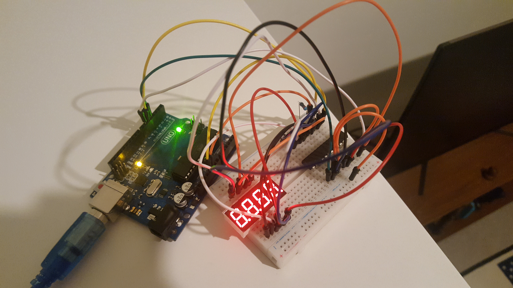

# Exercice 3
Dans cet exercice on cherche à contrôler une matrice 8x8 pour afficher du texte et des formes.

## Montage
Le montage était relativement simple. Cependant notre matrice 8x8 est légèrement défectueuse car une des LED ne fonctionne pas et une ligne reste légèrement allumée quoi qu'il arrive.

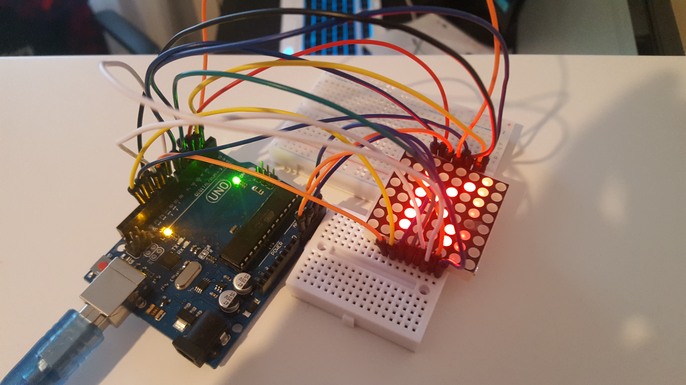

On a repris un code présent sur internet que l'on a modifié pour afficher ce qu'on voulait :

    //update from SAnwandter
    
    #define ROW_1 2
    #define ROW_2 3
    #define ROW_3 4
    #define ROW_4 5
    #define ROW_5 6
    #define ROW_6 7
    #define ROW_7 8
    #define ROW_8 9
    
    #define COL_1 10
    #define COL_2 11
    #define COL_3 12
    #define COL_4 13
    #define COL_5 A0
    #define COL_6 A1
    #define COL_7 A2
    #define COL_8 A3
    
    const byte rows[] = {
        ROW_1, ROW_2, ROW_3, ROW_4, ROW_5, ROW_6, ROW_7, ROW_8
    };
    const byte col[] = {
      COL_1,COL_2, COL_3, COL_4, COL_5, COL_6, COL_7, COL_8
    };
    
    // The display buffer
    // It's prefilled with a smiling face (1 = OFF, 0 = ON)
    byte A[] = {B11111111,B11000011,B10011001,B10011001,B10000001,B10011001,B10011001,B10011001};
    byte B[] = {B10000111,B10110111,B10110111,B10001111,B10110111,B10111011,B10111011,B10000011};
    byte C[] = {B11111111,B11100001,B11011111,B10111111,B10111111,B10111111,B11011111,B11100001};
    byte D[] = {B11111111,B11000111,B11011011,B11011101,B11011101,B11011011,B11000111,B11111111};
    byte E[] = {B11111111,B11000011,B11011111,B11000111,B11011111,B11011111,B11000011,B11111111};
    byte F[] = {B11111111,B11000011,B11011111,B11000111,B11011111,B11011111,B11011111,B11111111};
    byte G[] = {B11111111,B11000001,B11011111,B11011111,B11010001,B11011101,B11000001,B11111111};
    byte H[] = {B11111111,B11011011,B11011011,B11000011,B11011011,B11011011,B11011011,B11111111};
    byte I[] = {B11111111,B11000111,B11101111,B11101111,B11101111,B11101111,B11000111,B11111111};
    byte J[] = {B11111111,B11100011,B11110111,B11110111,B11110111,B11010111,B11000111,B11111111};
    byte K[] = {B11111111,B11011011,B11010111,B11001111,B11010111,B11011011,B11011011,B11111111};
    byte L[] = {B11111111,B11011111,B11011111,B11011111,B11011111,B11011111,B11000011,B11111111};
    byte M[] = {B11111111,B11111111,B10111011,B01010101,B01101101,B01111101,B01111101,B11111111};
    byte N[] = {B11111111,B11011101,B11001101,B11010101,B11011001,B11011101,B11111111,B11111111};
    byte O[] = {B11111111,B11000011,B10111101,B10111101,B10111101,B10111101,B11000011,B11111111};
    byte P[] = {B11111111,B11000111,B11011011,B11011011,B11000111,B11011111,B11011111,B11111111};
    byte Q[] = {B11111111,B11000011,B10111101,B10111101,B10111101,B10111001,B11000001,B11111110};
    byte R[] = {B11111111,B11000111,B11011011,B11011011,B11000111,B11011011,B11011011,B11111111};
    byte S[] = {B11111111,B11000011,B11011111,B11000011,B11111011,B11111011,B11000011,B11111111};
    byte T[] = {B11111111,B10000011,B11101111,B11101111,B11101111,B11101111,B11101111,B11111111};
    byte U[] = {B11111111,B10111101,B10111101,B10111101,B10111101,B11011011,B11100111,B11111111};
    byte V[] = {B11111111,B11011101,B11011101,B11011101,B11101011,B11101011,B11110111,B11111111};
    byte W[] = {B11111111,B01111101,B01101101,B10101011,B10101011,B11010111,B11111111,B11111111};
    byte X[] = {B11111111,B10111101,B11011011,B11100111,B11100111,B11011011,B10111101,B11111111};
    byte Y[] = {B11111111,B10111011,B11010111,B11101111,B11101111,B11101111,B11101111,B11111111};
    byte Z[] = {B11111111,B11000011,B11111011,B11110111,B11101111,B11011111,B11000011,B11111111};
    byte emoji[] = {B11111111,B11011011,B11011011,B11111111,B11111111,B10111101,B11000011,B11111111};
    
    float timeCount = 0;
    
    void setup() 
    {
        // Open serial port
        Serial.begin(9600);
        
        // Set all used pins to OUTPUT
        // This is very important! If the pins are set to input
        // the display will be very dim.
        for (byte i = 2; i <= 13; i++)
            pinMode(i, OUTPUT);
        pinMode(A0, OUTPUT);
        pinMode(A1, OUTPUT);
        pinMode(A2, OUTPUT);
        pinMode(A3, OUTPUT);
    }
    
    void loop() {
      // This could be rewritten to not use a delay, which would make it appear brighter
    delay(5);
    timeCount += 1;
    
    if(timeCount <  200) 
    {
      drawScreen(K);
    } 
    else if (timeCount <  400) 
    {
      drawScreen(A);
    } 
    else if (timeCount <  600) 
    {
      drawScreen(R);
    } 
    else if (timeCount <  800) 
    {
      drawScreen(A);
    } 
    else if (timeCount <  1000) 
    {
      drawScreen(D);
    } 
    else if (timeCount <  1200) 
    {
      drawScreen(I);
    } 
    else if (timeCount <  1400) {
      drawScreen(K);
    } 
    else if (timeCount < 2000) {
      drawScreen(emoji);
    }
    else {
      // back to the start
      timeCount = 0;
    }
    }
     void  drawScreen(byte buffer2[])
     { 
       // Turn on each row in series
        for (byte i = 0; i < 8; i++)        // count next row
         {
            digitalWrite(rows[i], HIGH);    //initiate whole row
            for (byte a = 0; a < 8; a++)    // count next row
            {
              // if You set (~buffer2[i] >> a) then You will have positive
              digitalWrite(col[a], (buffer2[i] >> a) & 0x01); // initiate whole column
              
              delayMicroseconds(100);       // uncoment deley for diferent speed of display
              //delayMicroseconds(1000);
              //delay(10);
              //delay(100);
              
              digitalWrite(col[a], 1);      // reset whole column
            }
            digitalWrite(rows[i], LOW);     // reset whole row
            // otherwise last row will intersect with next row
        }
    }

Chaque byte permet d'afficher un caractère (0 = LED allumée, 1 = LED éteinte). C'était donc assez intuitif de rajouter l’émoji que nous souhaitions dessiner. Le code est relativement bien commenté et simple à comprendre. Toutes les 2 secondes on affiche un caractère différent avec la fonction drawScreen.

On a donc le résultat suivant (pour l'émoji) :

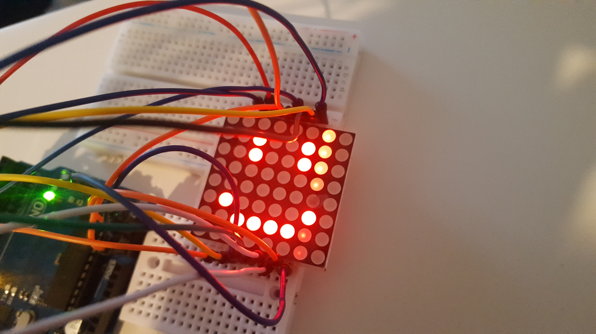

Et une vidéo de démonstration est également visible dans le dossier media **(ex3-matrice_8x8_demonstration.mp4)**.
On y affiche le nom de notre équipe ainsi qu'un émoji :)

