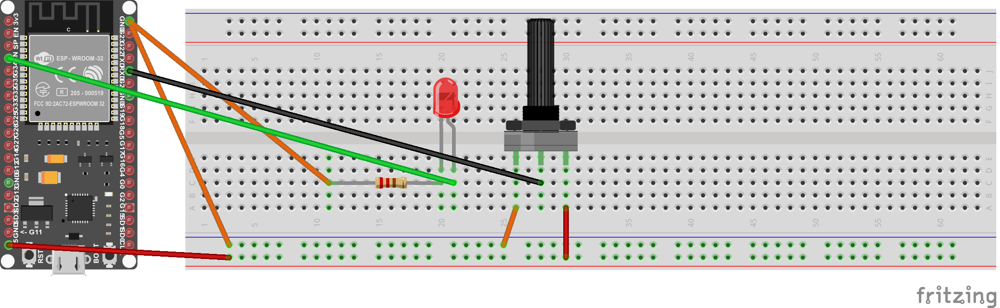

# Rapport sur l'exercice 1 du TP2

Dans cette partie nous avons utilisé le logiciel Fritzing pour modéliser les branchements pour l'exercice 1 du TP1, mais cette fois-ci avec non pas un Arduino UNO mais un NodeMCU ESP32-S. Cette exercice nous a permis d'en apprendre un peu plus sur ce logiciel et sur le fonctionnement d'un ESP32.
Dans notre TP1 nous avons mis en place le branchement suivant :

Nous avons également obtenu comme schéma :

Le code qui permet d'allumer la LED selon la valeur du potentiomètre est très semblable à ce qu'on a fait dans le TP1. Cette fois-ci, on attache notre PIN au channel PWM 0. La fonction ledcSetup définit un channel PWM de 0, avec une fréquence de 5000 Hz et une résolution de 8 bits. 

    const int ledPin = 22;
    const int potPin = 36;
    
    void setup()
    {
      ledcAttachPin(ledPin, 0);
      ledcSetup(0, 5000, 8);
      Serial.begin(9600);
    }
    
    void loop()
    {
      int PWM = analogRead(potPin);
      PWM = map(PWM, 0, 1023, 0, 255); // Mapping reading to get values between 0 and 255
      ledcWrite(0, PWM);
      Serial.println(PWM);
    }

Afin de pouvoir vérifier que le schéma est correct, nous avons réalisé le montage "en vrai", et tout fonctionne :

Les cinq composants utilisés sont :
1. NodeMCU ESP32-S
2. Une Breadboard
3. Une LED
4. Un potentiomètre
5. Une résistance

Dans ce montage nous avons mis un potentiomètre pour pouvoir régler l'intensité de la LED. Ce potentiomètre doit prendre une sortie spécifique qui est indiquée dans les schémas sur Fritzing.
