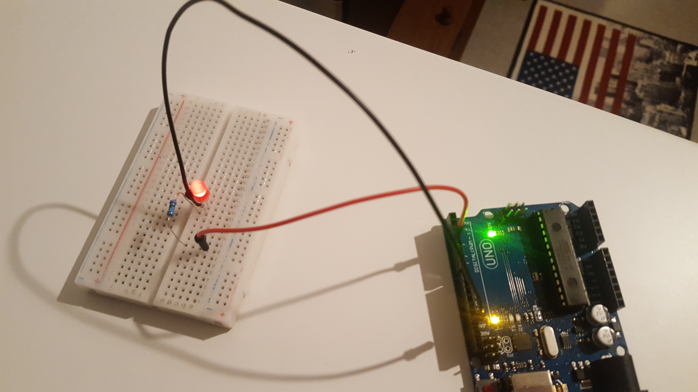
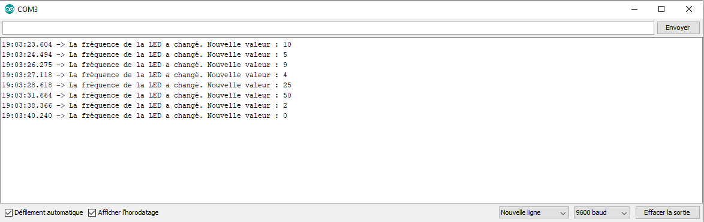
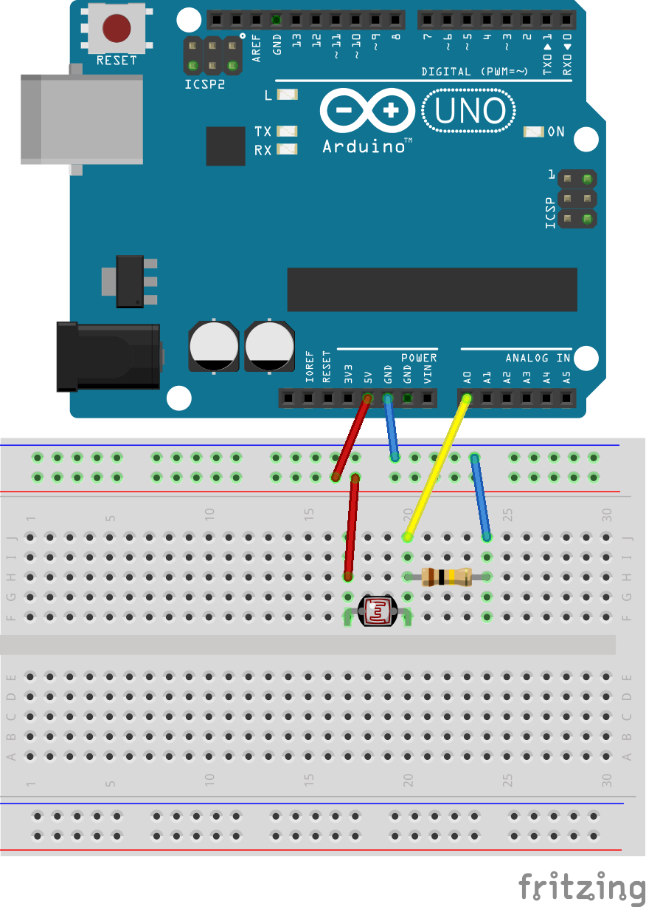
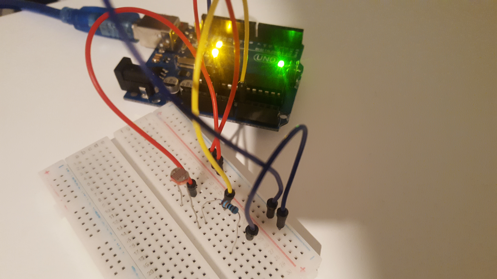
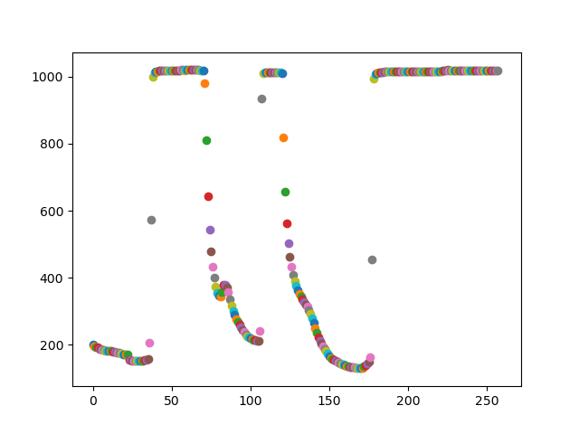

# Practise 2
## Passive buzzer
Dans cet exercice, nous devions changer la fréquence d'un buzzer selon la valeur lu depuis le serial. Cependant, dans notre kit, le buzzer était absent, et nous avons donc choisi d'utiliser une LED à la place.

Nous avons commencé par écrire le code : 

    const int ledPin = 3; // La LED est branchée sur le port 3
    
    void setup() {
      Serial.begin(9600);
      pinMode(ledPin, OUTPUT); // Assigne la LED en sortie
    }
    
    void loop() {
      if (Serial.available() > 1) { 
    	// On a mis > 1 pour que la LED reste allumée à la même fréquence 
    	// après chaque changement (sinon elle s'éteint)
        int frequency = Serial.parseInt();
        analogWrite(ledPin, frequency); // Change la fréquence de la LED avec celle entrée dans le Serial
        Serial.print("La fréquence de la LED a changé. Nouvelle valeur : ");
        Serial.println(frequency, DEC);
      }
    }
Le montage était assez simpliste (une LED, une petite résistance et quelques câbles) : 

En changeant la valeur de la fréquence via le moniteur serial, on observe que la fréquence de la LED est bien modifiée et celle-ci éclaire plus ou moins selon cette valeur.

## LDR
Dans cet exercice, on cherche à tester le principe de fonctionnement d'une LDR avec une carte Arduino, et à récupérer la valeur de l'intensité lumineuse perçue par cette LDR.

Pour ce faire, on réalise le montage suivant : 

On utilise ensuite ce code Arduino pour récupérer la valeur provenant du LDR : 

    int sensorPin = A0; // select the input pin for LDR
    int sensorValue = 0; // variable to store the value coming from the sensor
    
    void setup() {
    	Serial.begin(9600); //sets serial port for communication
    }
    
    void loop() {
    	sensorValue = analogRead(sensorPin); // read the value from the sensor
    	Serial.println(sensorValue); //prints the values coming from the sensor on the screen
    	delay(100);
    }
En utilisant le code Python fourni sur Lab-Two-2019, et en faisant tourner le code Arduino écrit ci-dessus, on obtient le graphe suivant : 

Quand le test a démarré, on avait au préalable éteint la lumière de la pièce (on n'était malgré tout pas dans le noir complet). La valeur envoyée par le LDR est d'environ 200.
On a ensuite éclairé la LDR avec une lampe torche, ce qui explique ce brusque saut de valeur (on passe à environ 1000). Après, on a déplacé la lampe torche, ce qui fait que la valeur renvoyée par la LDR a diminué de plus en plus (pour revenir à environ 200).
On a répété cette opération plusieurs fois.
